
<h1 align="center">基于的支教志愿者招聘系统</h1>

## 简介
支教志愿者招聘系统：角色分为管理员、用户；提供招聘管理、简历投递、消息通知、论坛互动、留言管理等功能，实现高效的志愿者招聘和信息交流。    --计算机毕业设计源码；毕设源码；java毕业设计源码

## 联系方式

<h3 align="center">获取完整代码与数据库文件 + 微信：deepguan QQ: 86050149 QQ群: 783742310</h3>

<h3 align="center">可帮忙远程部署 包运行成功！提供远程部署、修改代码、设计文档指导、代码讲解等服务！</h3>

## 功能介绍（完整见运行截图）
管理员：管理员可以通过后台管理界面对系统进行全面管理，包括用户管理、职位招聘管理、支援学校管理、简历管理和论坛管理等。管理员可以查看和修改用户信息，管理招聘信息发布与审核，维护支教学校的相关数据，以及管理系统内的留言和评论。管理员还负责公告发布和论坛话题的监督，以确保系统的高效运作和信息交流的规范化。

志愿者：志愿者可以通过系统进行注册并登录个人中心来管理个人信息，完善简历和查阅已投递的职位。可通过职位招聘模块浏览可申请的支教岗位，并利用简历投递功能提交申请。同时，系统提供简历收藏和职位评论等功能，以便志愿者快速找到合适的职位以及反馈求职体验。志愿者还可以在论坛模块发布帖子和参与讨论，与其他志愿者互动交流。

学校管理员：学校管理员可以登录系统查看和管理本校的支教招聘信息。学校可以在招聘信息发布页面输入相关职位信息，管理已发布的职位列表，并查看志愿者的求职意向及简历投递情况。此外，学校管理员可通过留言板功能与志愿者进行交流，提升双方沟通的有效性，确保招聘信息的精准传达。

游客：游客可无需注册访问网站，浏览主页面的招聘信息、支援学校介绍、公告及论坛内容。游客可以通过搜索功能快速了解特定学校或职位的相关信息，阅读学校简介及招聘要求。虽然游客无法直接申请职位或管理个人信息，但他们可以通过系统获取关于支教志愿服务的全面信息，从而对参与产生兴趣并最终选择注册成为志愿者。

## 运行截图
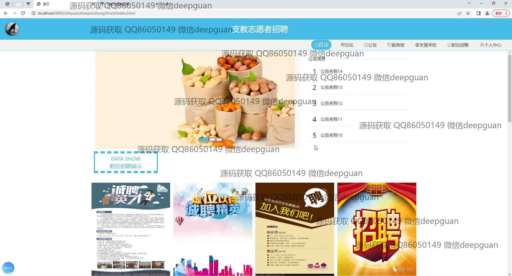
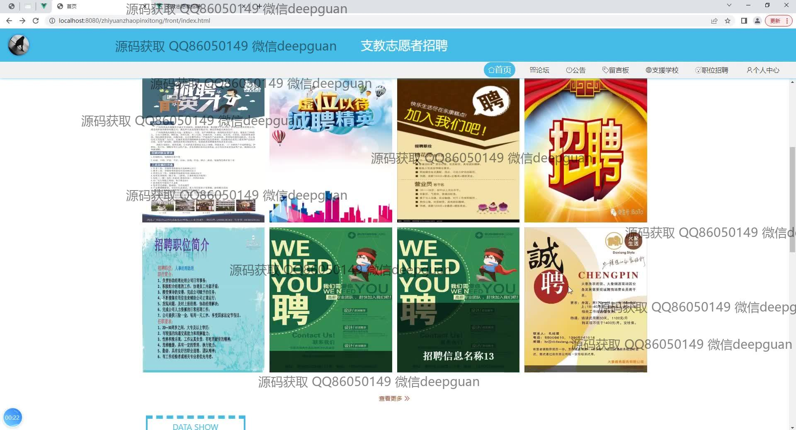
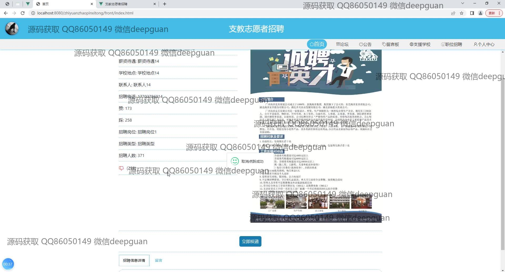
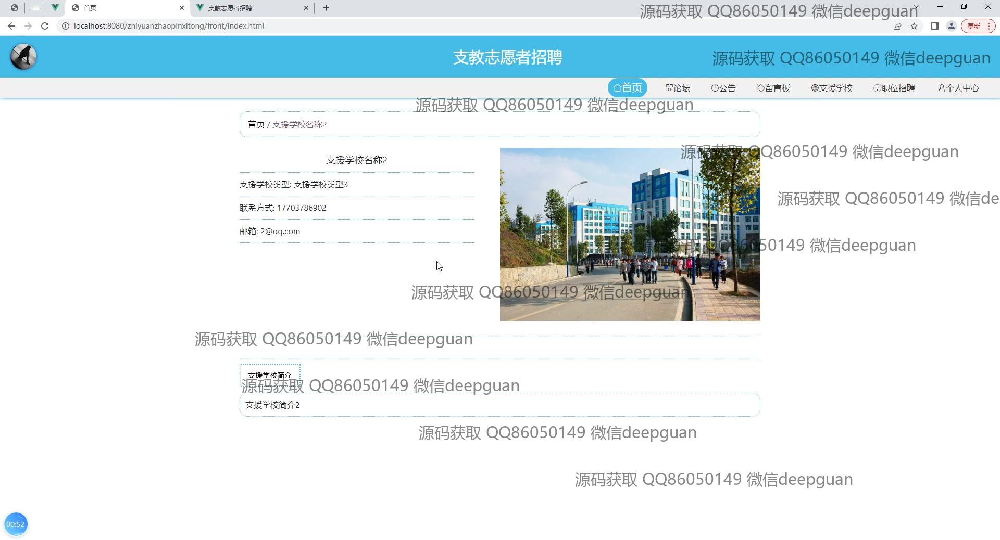
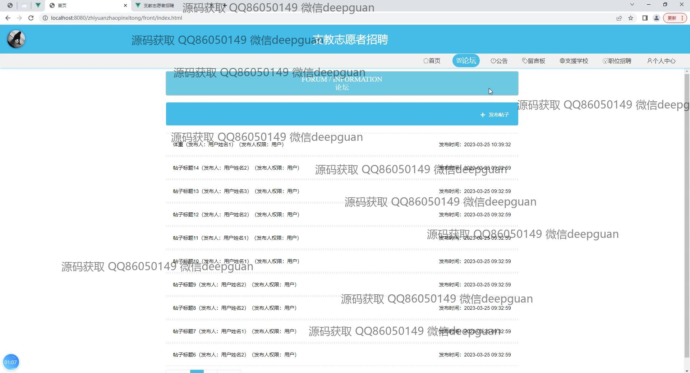
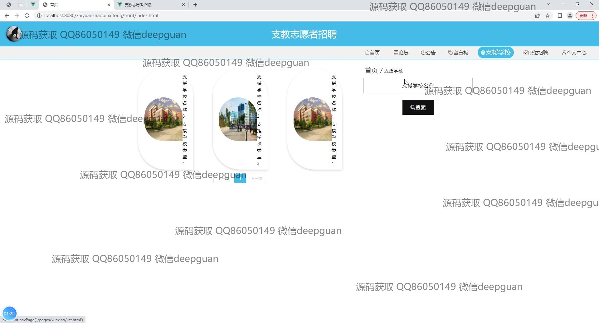
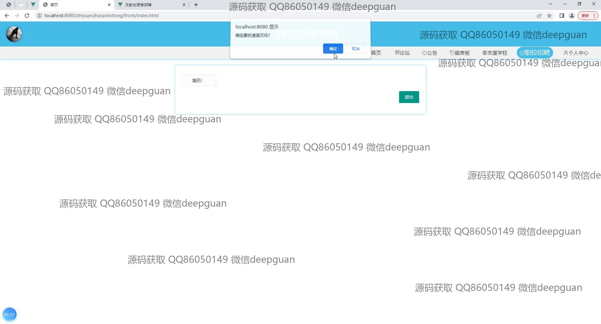
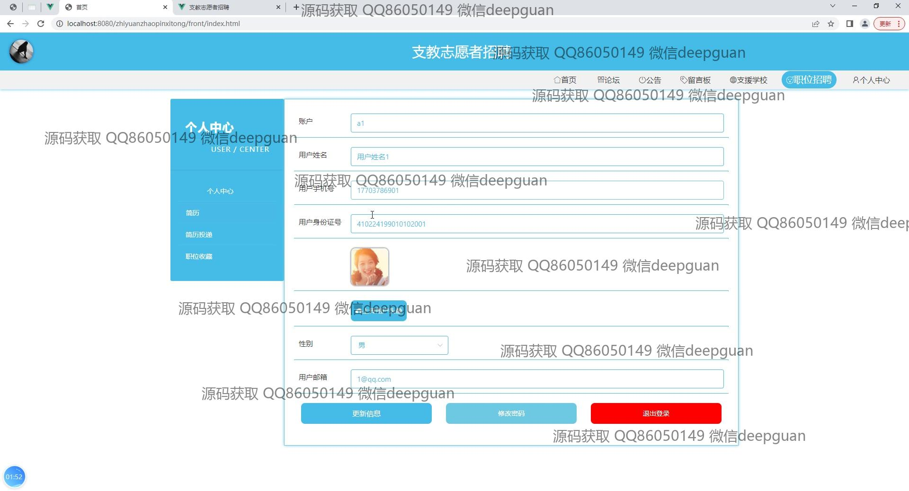
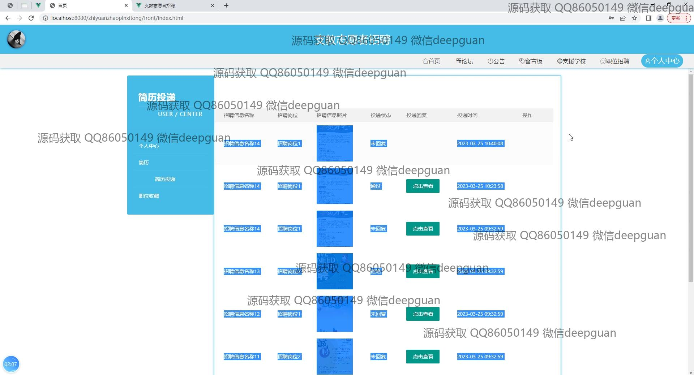
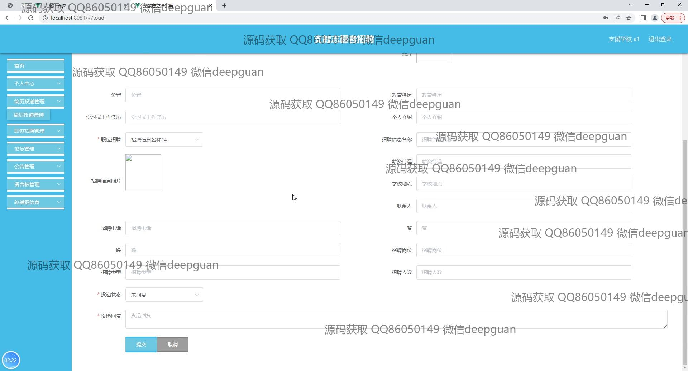
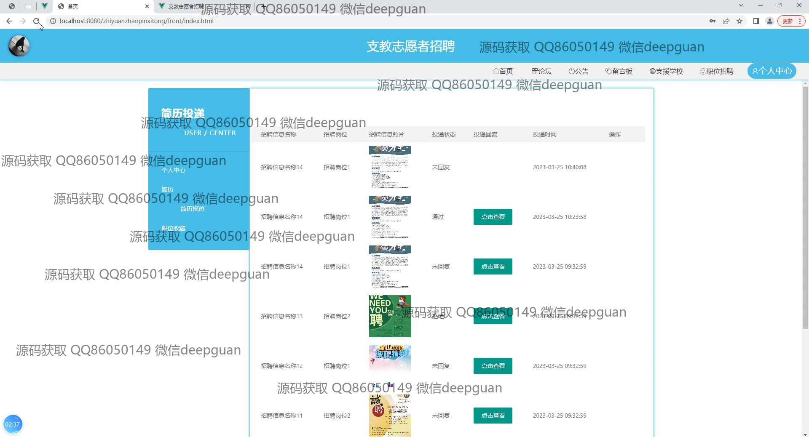
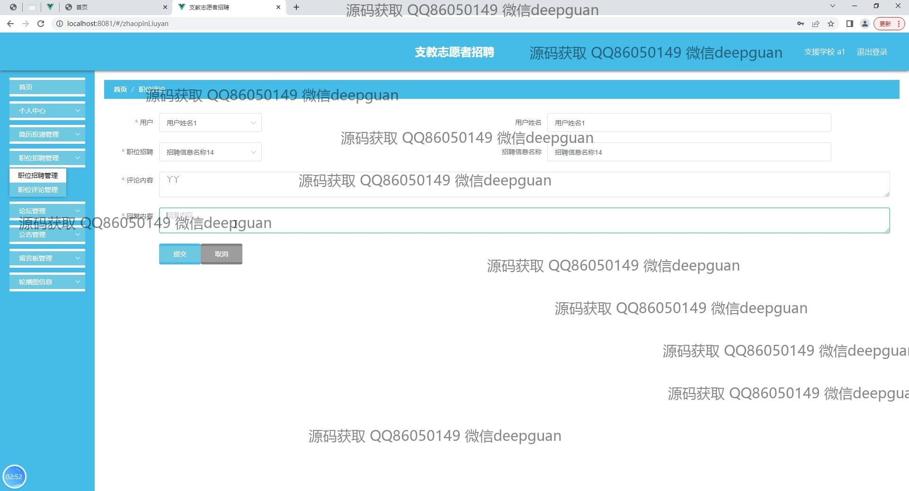
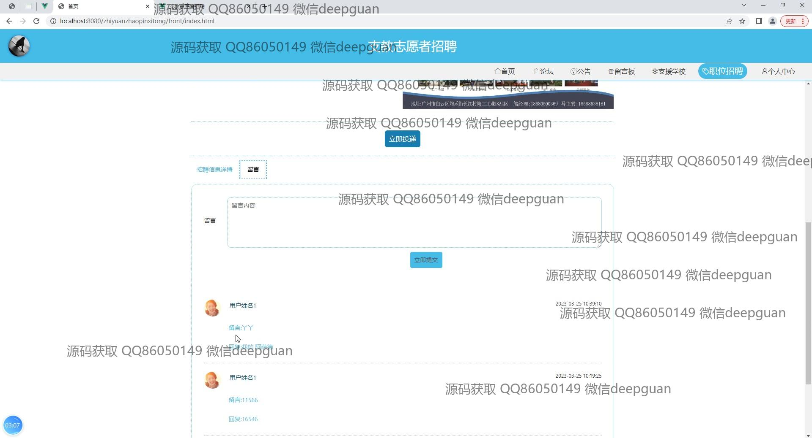
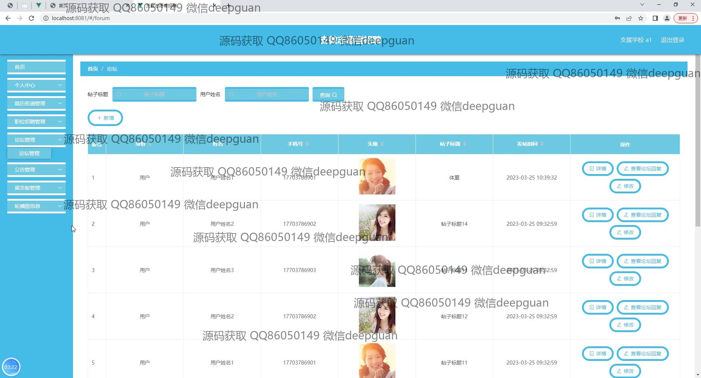
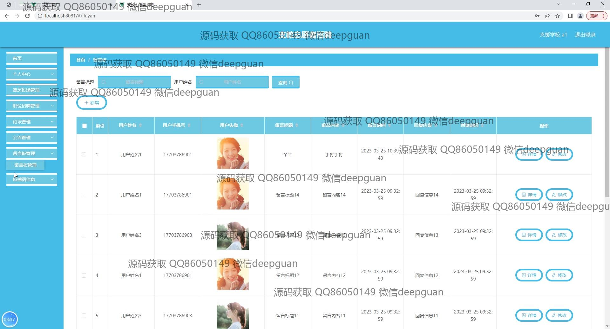
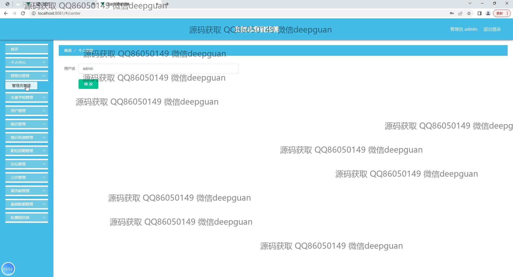
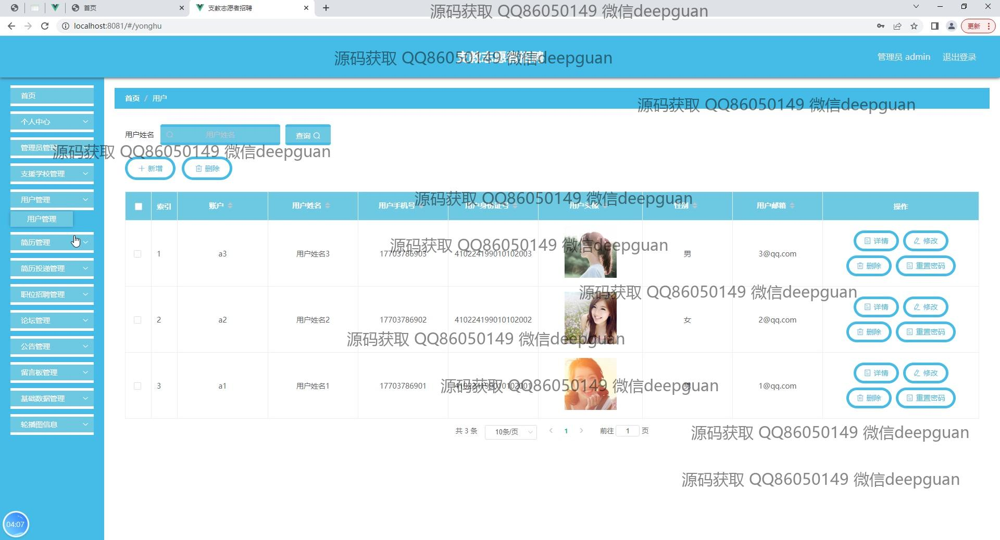
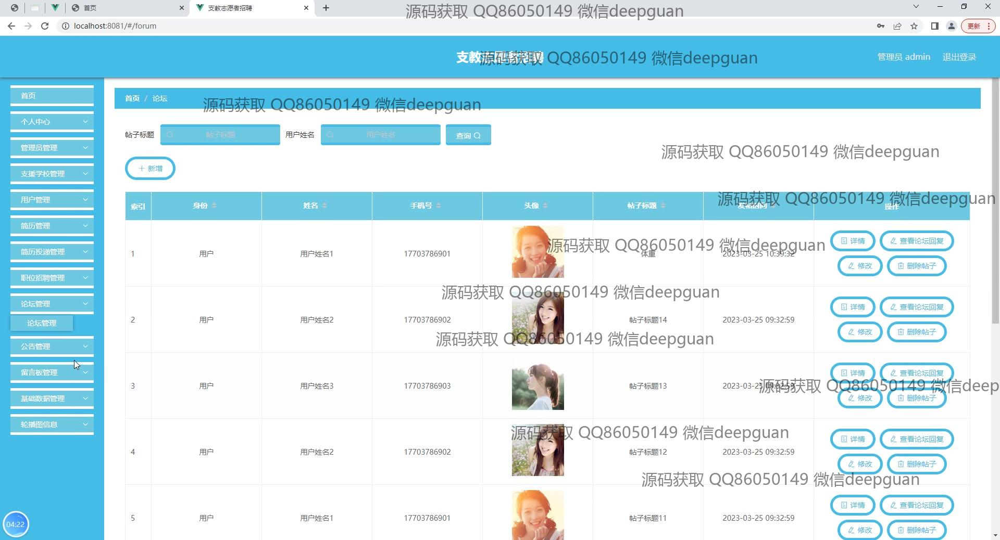
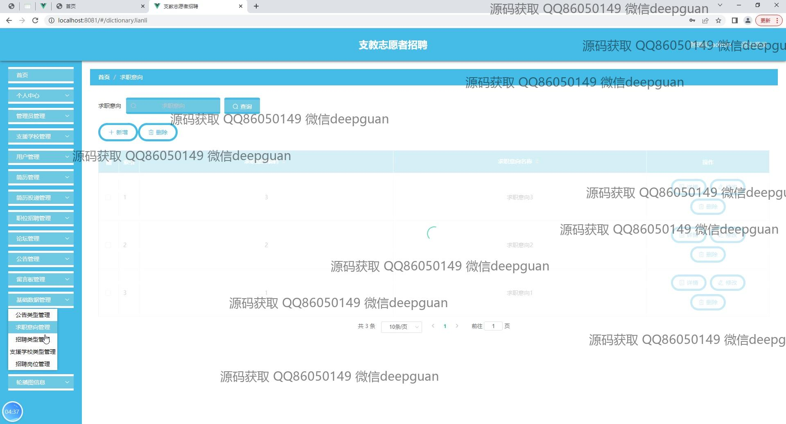

本代码来源于网络,仅供学习参考使用!

